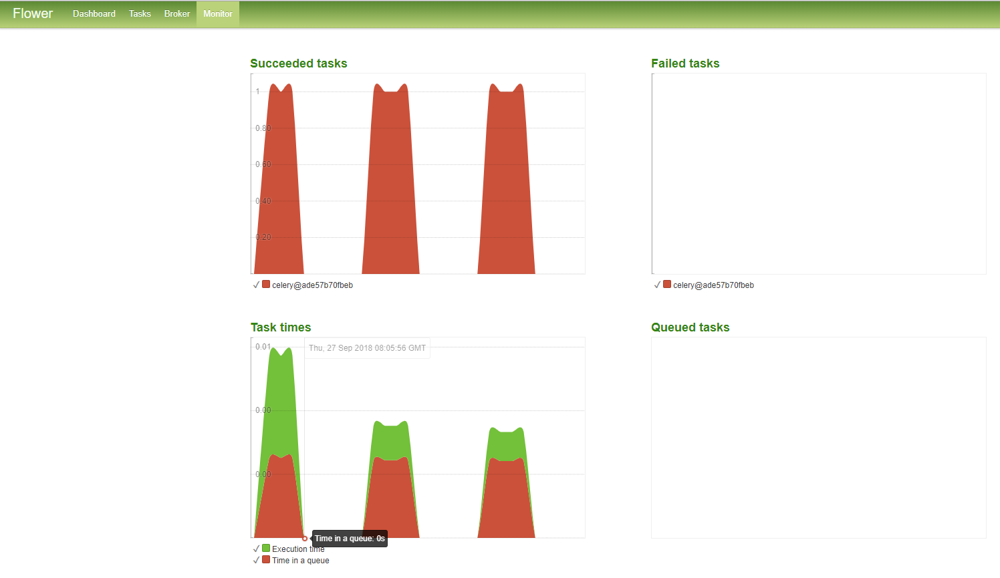
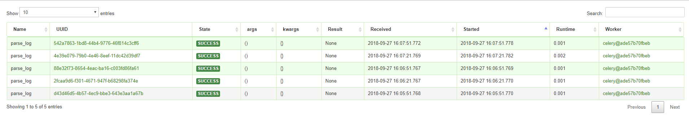
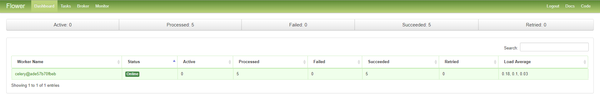

# Tornado Web Template


Tornado is AsyncIO web framework, which is famous for high concurrency IO operation 
that is very suitable for developing restful style web APIs.

[](https://asciinema.org/a/YTtcBNnOItY8IRXjBx7E70VIc)


celery flower task monitor：








# Feature

- Python 3.5+ Async / Await support
- uvloop 
- celery tasks
- docker compose support
- json schema web params validate
- middleware error handler
- request_id support
- flower task monitor
- health check task support
- custom log style
- aioredis pool 
- aiomysql pool
- unittest template
- pylint code check
- wrk web api benchmark test

# Operations

current supported operations:

```shell
(tornado-restful-cookiecutter) ➜  tornado-restful-cookiecutter make help
Please use 'make <target>' where <target> is one of
  build         builds docker-compose containers
  up            starts docker-compose containers
  down          stops the running docker-compose containers
  rebuild       rebuilds the image from scratch without using any cached layers
  test          starts run unittest inside web container.
  lint          use pylint to check all .py files

```

# Run

```shell
make up
```

# Unittest

```shell
make test
```

output:

```shell
(tornado-restful-cookiecutter) ➜  tornado-restful-cookiecutter make test   
sudo docker-compose -f local.yaml exec tornado python run_test.py
b'{"code": 0, "data": {"number": 1}, "msg": ""}'
测试失败:  []
测试错误:  []
测试结果: 通过 <unittest.runner.TextTestResult run=2 errors=0 failures=0>
```

# Pylint

use `pylint` to lint \*.py files and the pylint config is `3rd/pylint/pylint.rc`.

```shell
make lint
```

# Benchmark

use [wrk](https://github.com/wg/wrk) to run api load test:

```shell
./wrk -c 100 -t 5 -d 20s http://localhost:8000/api/v1/counter\?name\=zhangsan
```

# Celery tasks

celery application instance is inside `celery_app.py`, you can write celery task in `celery_tasks.tasks`.

# Log template

tornado log file content example:

```shell
## access log
127.0.0.1 - - [09/23/18:18:18:34 +0800] "GET /api/v1/counter HTTP/1.1" 200 0 1.50 dd50668528cd417a86f9e2f331a9cbf6 app-up [{}] -
127.0.0.1 - - [09/23/18:18:18:34 +0800] "GET /api/v1/counter HTTP/1.1" 200 0 1.50 69aa272728cb45fdbcfbe8334ff1a117 app-up [{}] -
127.0.0.1 - - [09/23/18:18:18:34 +0800] "GET /api/v1/counter HTTP/1.1" 200 0 1.50 5aa968a778374df2b327e24a27cd9ff4 app-up [{}] -
127.0.0.1 - - [09/23/18:18:18:34 +0800] "GET /api/v1/counter HTTP/1.1" 200 0 0.98 0930f80545ed4d7eb8521742a9f65189 app-up [{}] -
127.0.0.1 - - [09/23/18:18:18:34 +0800] "GET /api/v1/counter HTTP/1.1" 200 0 0.98 4641fd35c6934c7eb0a359ffd7e18ab1 app-up [{}] -


## app log
2018-09-23 17:47:36,984 ERROR 9df1c32f753f41e4aa3d8047523902ba-3908 response.py:63 -- Expecting value: line 1 column 1 (char 0)
Traceback (most recent call last):
  File "E:\workspace\tornado-restfull-cookiecutter\application\response.py", line 83, in __wrapper__
    return await method(*args, **kwargs)
  File "E:\workspace\tornado-restfull-cookiecutter\application\handlers\counter\handler.py", line 35, in get
    print(self.request.body)
  File "C:\python36\lib\json\__init__.py", line 354, in loads
    return _default_decoder.decode(s)
  File "C:\python36\lib\json\decoder.py", line 339, in decode
    obj, end = self.raw_decode(s, idx=_w(s, 0).end())
  File "C:\python36\lib\json\decoder.py", line 357, in raw_decode
    raise JSONDecodeError("Expecting value", s, err.value) from None
json.decoder.JSONDecodeError: Expecting value: line 1 column 1 (char 0)


## gen log

```
